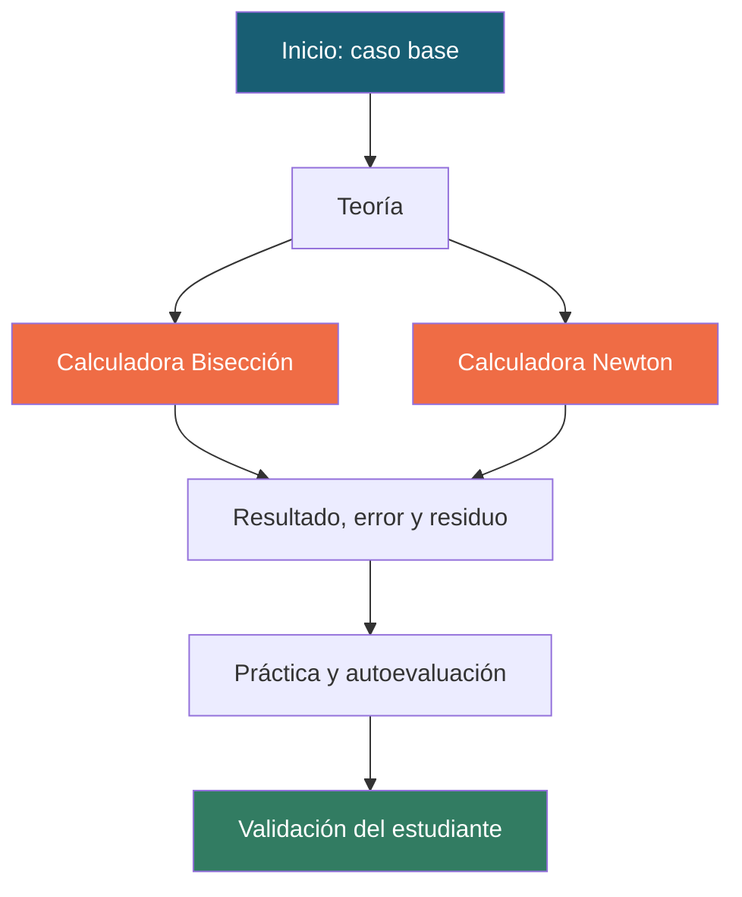
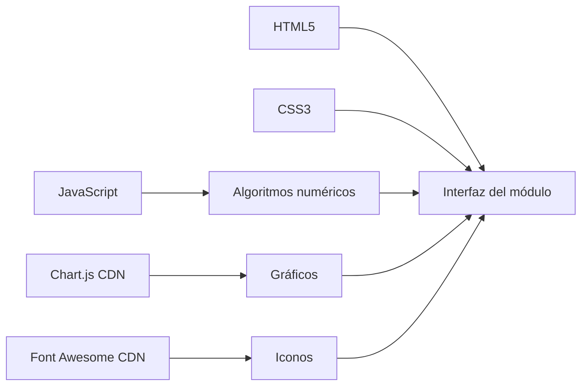

# Entregable 1 · Ecuaciones no lineales

Módulo interactivo del Laboratorio de Métodos Numéricos. Su objetivo es que el estudiante entienda cuándo y cómo usar Bisección y Newton para resolver `f(x) = 0`.

[](https://rwciana.github.io/LAB-MN/)
[](https://github.com/rwciANA/LAB-MN/tree/main/Entregable_1_Ecuaciones_No_Lineales)

## Caso aplicado

Se estudia la función:

$$
f(x) = x^3 - x - 2
$$

con intervalo inicial `[1, 2]`. Como `f(1) = -2` y `f(2) = 4`, existe un cambio de signo y Bisección puede comenzar. La raíz de referencia es aproximadamente `1.5213797068`.

```mermaid
xychart-beta
    title "Comportamiento aproximado de f(x)"
    x-axis "x" [0, 0.5, 1, 1.5, 2, 2.5]
    y-axis "f(x)" -3 --> 12
    line [-2, -1.375, -2, -0.125, 4, 11.125]
```

## Recorrido de aprendizaje



## Funcionalidades

### Teoría

- Fórmula del punto medio: `c = (a + b) / 2`.
- Fórmula de Newton: `x(n+1) = x(n) - f(x(n)) / f'(x(n))`.
- Condiciones de uso, ventajas, limitaciones y criterios de parada.

### Calculadoras

- Parámetros editables y datos precargados.
- Tolerancia predeterminada `0.000001`.
- Máximo predeterminado de `100` iteraciones.
- Validación de extremos con cambio de signo para Bisección.
- Validación de derivada no nula para Newton.
- Tabla de las iteraciones más recientes.
- Gráfico de convergencia con Chart.js.
- Exportación de iteraciones a CSV.

### Práctica

Incluye cuatro ejercicios sobre intervalos válidos, selección del método, residuo y primer paso de Newton. Cada ejercicio muestra retroalimentación cuando se revisa.

## Archivos

| Archivo | Propósito |
| --- | --- |
| `index.html` | Estructura, contenido, navegación y controles. |
| `styles.css` | Diseño visual responsive, estados y animaciones. |
| `app.js` | Algoritmos, validaciones, tablas, gráficos y exportación CSV. |

## Tecnologías



## Ejecución local

Desde la raíz del repositorio:

```bash
python -m http.server 8000
```

Abre `http://localhost:8000/Entregable_1_Ecuaciones_No_Lineales/`.

También puedes abrir `index.html` directamente, aunque el servidor local evita restricciones del navegador y permite probar la aplicación como un sitio real.

## Pruebas sugeridas

| Prueba | Entrada | Resultado esperado |
| --- | --- | --- |
| Bisección base | `a=1`, `b=2` | Raíz cercana a `1.5213797` |
| Newton base | `x0=1.5` | Convergencia rápida a la raíz |
| Intervalo inválido | `a=2`, `b=3` | Mensaje de cambio de signo requerido |
| Tolerancia pequeña | `1e-8` | Más iteraciones y menor error |
| Exportación | Botón de descarga | Archivo CSV con iteraciones |

## Equipo y roles

| Letra | Integrante | Rol |
| --- | --- | --- |
| A | Condori Idme Raul Wilfredo | Validación y coordinación |
| B | Quispe Rupaylla Fabrizio Alonso | Matemática y modelación |
| C | Suarez Huamani Marco Antonio | Diseño didáctico y web |
| D | Chura Monroy Daniel Wilston | Programación numérica |

## Publicación

La versión publicada se encuentra en:

**https://rwciana.github.io/LAB-MN/**

La rama `gh-pages` contiene los archivos web en su raíz para que GitHub Pages pueda servir `index.html` directamente.

## Evidencias para el informe

El informe Word se encuentra fuera de este repositorio, junto al TXT de la guía. Allí deben insertarse las capturas de:

- Pantalla de inicio y gráfica.
- Teoría de Bisección y Newton.
- Calculadora de cada método.
- Tabla de iteraciones y resultado.
- Ejercicios.
- Tabla de integrantes.
- Repositorio, commits y GitHub Pages.