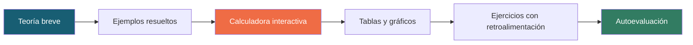

<div align="center">

# ITERA · Laboratorio de Métodos Numéricos

### Portal educativo · UNSA · Ingeniería de Sistemas

[](https://github.com/rwciANA/LAB-MN)
[](https://github.com/rwciANA/LAB-MN)
[](https://rwciana.github.io/LAB-MN/)

</div>

---

## ¿Qué es este proyecto?

Portal web educativo que permite **estudiar métodos numéricos, ejecutar algoritmos, observar sus resultados y comprobar su precisión** mediante problemas aplicados de Ingeniería de Sistemas.

Cada módulo temático incluye teoría, ejemplos resueltos, calculadoras interactivas, gráficos, ejercicios con retroalimentación y autoevaluación. Todo se ejecuta en el navegador, sin servidores ni instalaciones.

## ¿Para quién es?

**Usuario destinatario:** personas autodidactas con conocimientos básicos de programación que desean aprender métodos numéricos y su aplicación en Ingeniería de Sistemas, sin necesidad de un docente ni de un entorno instalado.

## Temas del portal

| Tema | Métodos interactivos |
|------|---------------------|
| Ecuaciones no lineales y errores | Bisección y Newton |
| Sistemas de ecuaciones lineales | Eliminación con pivoteo parcial y Gauss-Seidel |
| Interpolación y ajuste de curvas | Interpolación de Lagrange y regresión lineal |
| Integración numérica | Trapecio compuesto y Simpson compuesto |
| Ecuaciones diferenciales | Euler explícito y Runge-Kutta de orden 4 |

## Recorrido de aprendizaje



## Tecnologías

- **HTML, CSS y JavaScript** — módulos ejecutables en el navegador.
- **Chart.js** — gráficos interactivos (CDN).
- **Font Awesome** — iconografía (CDN).
- **GNU Octave / Python** — referencia independiente de cálculo.
- **GitHub Pages** — publicación del portal.

## Ejecución local

```bash
# Clonar el repositorio
git clone https://github.com/rwciANA/LAB-MN.git
cd LAB-MN

# Servir con cualquier servidor estático
python -m http.server 8000
```

Luego abre `http://localhost:8000/` y navega al módulo deseado.

> También puedes abrir cualquier `index.html` directamente en el navegador. Se requiere conexión a internet para cargar Chart.js y Font Awesome desde CDN.

## Estructura del repositorio

```
LAB-MN/
├── README.md          ← Este archivo (visión global del portal)
├── .gitignore
└── [módulos]/         ← Cada tema se desarrolla en su propia carpeta
```

## Publicación

El portal está disponible en:

**https://rwciana.github.io/LAB-MN/**

---

<div align="center">
UNSA · Ingeniería de Sistemas · Laboratorio de Métodos Numéricos · 2026
</div>
