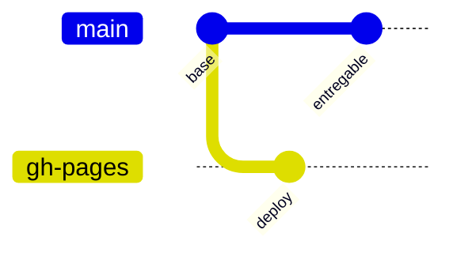

# Laboratorio de Métodos Numéricos

Portal educativo para estudiar, ejecutar y comparar métodos numéricos aplicados a problemas de Ingeniería de Sistemas.

[](https://github.com/rwciANA/LAB-MN)
[](https://github.com/rwciANA/LAB-MN)
[](https://rwciana.github.io/LAB-MN/)

## Vista general

El repositorio reúne los entregables de un portal común con cinco módulos. El primer módulo implementado aborda **ecuaciones no lineales** mediante Bisección y Newton.


## Módulos del proyecto

| Módulo | Métodos previstos | Estado |
| --- | --- | --- |
| 1. Ecuaciones no lineales | Bisección y Newton | Implementado |
| 2. Sistemas lineales | Pivoteo parcial y Gauss-Seidel | Planificado |
| 3. Interpolación y ajuste | Lagrange y regresión lineal | Planificado |
| 4. Integración numérica | Trapecio y Simpson 1/3 | Planificado |
| 5. Ecuaciones diferenciales | Euler y RK4 | Planificado |

## Entregable 1

Entra al módulo desde [Entregable 1: Ecuaciones no lineales](Entregable_1_Ecuaciones_No_Lineales/README.md) o abre directamente [la aplicación](Entregable_1_Ecuaciones_No_Lineales/index.html).

Incluye:

- Caso base `f(x) = x^3 - x - 2` en `[1, 2]`.
- Explicación de Bisección y Newton.
- Calculadoras con tolerancia y máximo de iteraciones.
- Tabla de iteraciones y gráfico de convergencia.
- Descarga de resultados en CSV.
- Cuatro ejercicios con retroalimentación.
- Sección de integrantes, roles y ruta del entregable.

## Estructura

```text
LAB-MN/
├── README.md
└── Entregable_1_Ecuaciones_No_Lineales/
	 ├── index.html
	 ├── styles.css
	 ├── app.js
	 └── README.md
```

## Ejecución local

1. Clona el repositorio:

	```bash
	git clone https://github.com/rwciANA/LAB-MN.git
	cd LAB-MN
	```

2. Abre `Entregable_1_Ecuaciones_No_Lineales/index.html` en un navegador moderno.

3. Para una experiencia más estable, sirve la carpeta con cualquier servidor estático local:

	```bash
	python -m http.server 8000
	```

	Luego visita `http://localhost:8000/Entregable_1_Ecuaciones_No_Lineales/`.

Las gráficas usan Chart.js y los iconos usan Font Awesome desde CDN; se necesita conexión a internet para cargarlos.

## Publicación

La rama `gh-pages` contiene una copia preparada para GitHub Pages. La página pública es:

**https://rwciana.github.io/LAB-MN/**

Flujo de publicación:



## Equipo

| Letra | Integrante | Responsabilidad |
| --- | --- | --- |
| A | Condori Idme Raul Wilfredo | Validación y coordinación |
| B | Quispe Rupaylla Fabrizio Alonso | Matemática y modelación |
| C | Suarez Huamani Marco Antonio | Diseño didáctico y web |
| D | Chura Monroy Daniel Wilston | Programación numérica |

## Convenciones de trabajo

- Los cambios funcionales deben probarse en el navegador antes del commit.
- Los algoritmos deben mostrar criterio de parada, error y residuo.
- Las capturas y evidencias se documentan en el informe externo al repositorio.
- Los commits deben describir una unidad de trabajo concreta.
